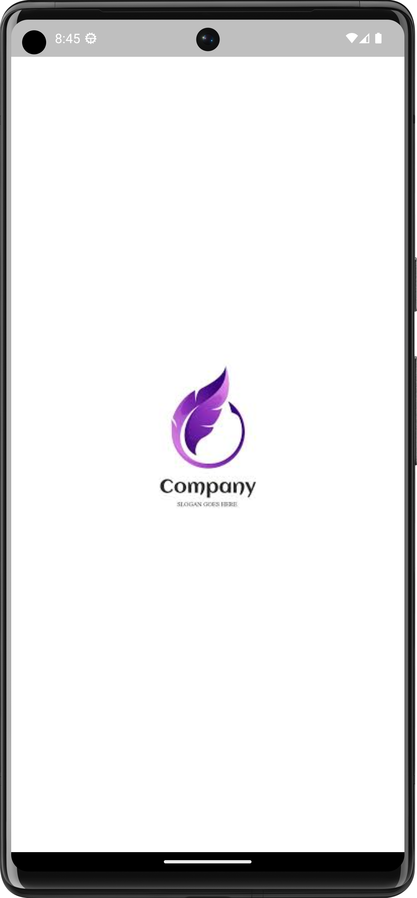
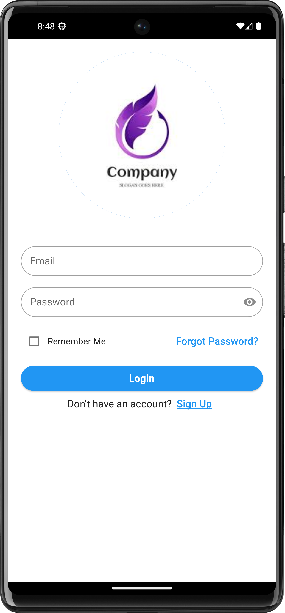
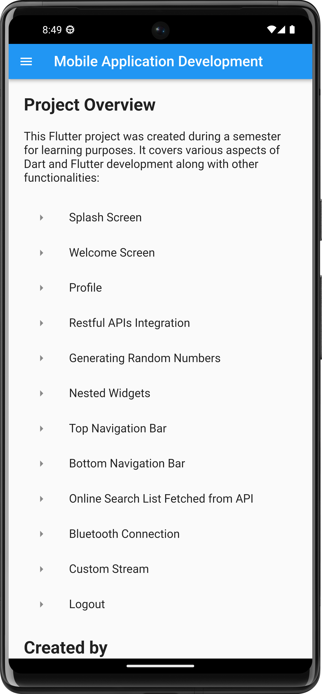
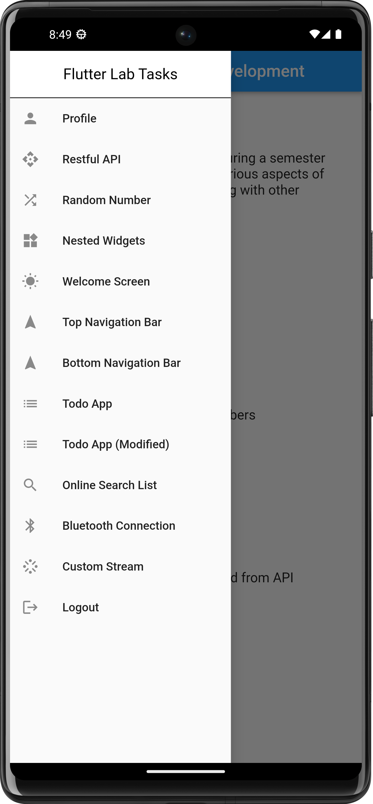
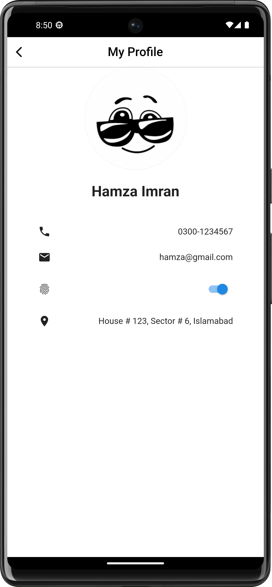

# Flutter Project README

## Project Overview

This Flutter project was developed during a semester for learning purposes. It encompasses a wide range of tasks, screens, and features to explore various aspects of Dart, Flutter, and API integration.

## Project Tasks

### 1. Splash Screen

- The project starts with a splash screen to provide a visually appealing introduction to the app.

### 2. Welcome Screen

- The welcome screen welcomes users to the app and provides initial instructions or information.

### 3. Profile Screen

- The profile screen allows users to view and edit their profile information.

### 4. Restful APIs Integration

- Integration of RESTful APIs to fetch and display data from external sources.

### 5. Generating Random Numbers

- Implementing functionality to generate random numbers within the app.

### 6. Nested Widgets

- Demonstrating the use of nested widgets to create complex UI structures.

### 7. Top Navigation Bar

- Implementing a top navigation bar for easy navigation between app sections.

### 8. Bottom Navigation Bar

- Implementing a bottom navigation bar for quick access to essential app features.

### 9. Online Search List Fetched from API

- Creating a searchable list that fetches data from an online API.

### 10. Bluetooth Connection

- Integrating Bluetooth functionality for device communication if applicable.

### 11. Custom Stream

- Implementing custom streams to handle data flow and updates within the app.

### 12. Logout

- Providing a secure and user-friendly logout option.

## Learning Outcomes

Throughout the development of this project, several key learning outcomes were achieved:

- Proficiency in Dart programming language.
- In-depth understanding of Flutter framework.
- Effective integration of RESTful APIs for data retrieval.
- UI/UX design skills including nested widgets.
- Navigation bar implementation (both top and bottom).
- Handling and managing Bluetooth connections (if applicable).
- Creation and usage of custom streams.
- Implementing user authentication and secure logout functionality.

## Screenshots


<p align="center">
  
  
  
  
  
</p>


## Getting Started

To run this Flutter project locally, follow these steps:

1. Clone the repository:

   ```bash
   git clone https://github.com/MHamzaImran/Flutter_Lab_Tasks.git

2. Navigate to the project directory:

   ```bash
   cd project-directory

3. Install the required dependencies:

   ```bash
   flutter pub get

4. Run the app:

   ```bash
   flutter run


    
